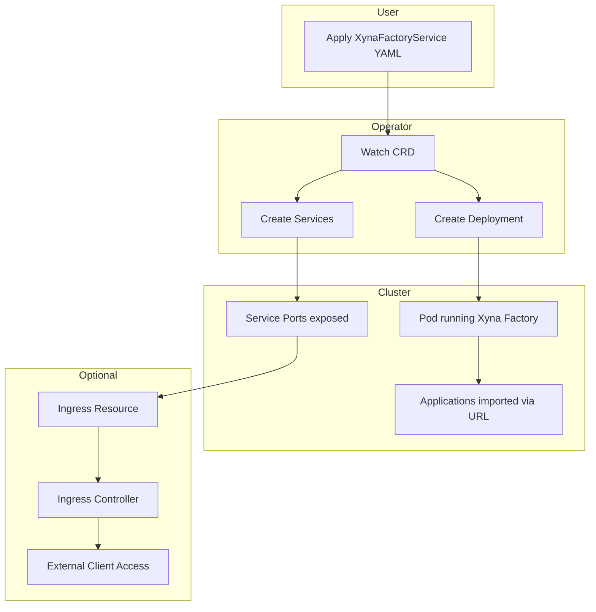

# Xyna Microservice Architecture

This document describes the architecture of the **Xyna Microservice Environment** on Kubernetes and how the operator handles the custom resources.

---

## Core Components

### 1. Custom Resource Definition (CRD)

- **XynaFactoryService**  
  Defines a single Xyna-based microservice.  
  Contains:
  - Docker image of the **Xyna Factory runtime**  
  - List of **Xyna Applications** to import  
  - Target **service ports** to expose  
  - Replica count  

### 2. Operator (Helm Deployment)

- Watches for `XynaFactoryService` objects in the cluster.  
- Reconciles resources to:
  - Create a `Deployment` that runs the Xyna Factory pods.  
  - Import the configured applications into the pods.  
  - Create `Service` objects for the defined ports.  
- Ensures that state in the cluster matches the CRD spec.

### 3. Applications

- Packaged `.app` files containing **Xyna Applications**.  
- Must be hosted at a URL accessible by the pods (not localhost).  
- If there are dependencies between applications, ordering must be handled manually.  

### 4. Ingress Controller (optional)

- Required if services need to be accessed from outside the cluster.  
- Traefik or NGINX can be used to map URLs to services.  

---

## Lifecycle of a Microservice

When a `XynaFactoryService` is applied:

1. **Custom Resource Submitted**  
   User applies YAML manifest describing the microservice.  

2. **Operator Reconciliation Loop**  
   - Operator detects new/updated CR.  
   - A Kubernetes `Deployment` is generated to run the specified Xyna Factory image.  
   - `Service` objects are created for each declared servicePort.  

3. **Image Pull and Pod Startup**  
   - Pods are created from the Xyna Factory image.  
   - After startup, the operator begins sequentially importing all declared applications.  

4. **Application Import**  
   - Applications are fetched from URLs and imported into the running factory.  
   - The order of import is based on `order` property.  
   - Without correct ordering, dependencies may fail and lead to startup errors.  

5. **Service Availability**  
   - Once the factory is initialized, the defined service ports are exposed.  
   - Readiness probe checks one of the TCP ports to determine pod health.  

6. **External Access (optional)**  
   - User applies an Ingress manifest.  
   - The Ingress controller routes external traffic to the Xyna services.  

---

## Architecture Diagram

---

## Limitations

- **Dependency management** of applications is *manual* (handled by `order`).  
- **Ingress manifests** are not generated automatically by the operator.  
- **Namespace handling** is not dynamic; manifests must be updated if deployed outside the example `xyna` namespace.  
- **No ARM64 support** (limited to amd64/x86).  

---

## Future Work

- Automate application dependency resolution.  
- Autogenerate ingress manifests as part of the operator.  
- Expand support for multiple architectures (e.g., ARM64).  
- Extend readiness/liveness probes beyond single TCP port checks.
